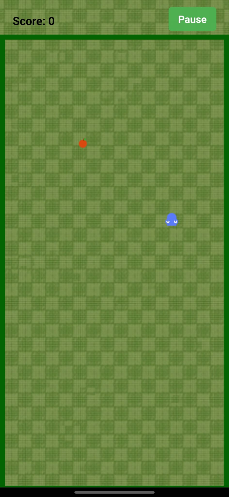

# Nokia Snake Game

A modern implementation of the classic Nokia Snake game built with React Native and Matter.js physics engine.

## Screenshots


*Main Menu Screen*


*Gameplay in Action - Starting*


*Gameplay in Action - Growing*


*Gameplay in Action - Advanced*


*Pause Menu*


*Game Over Screen*

## Gameplay Video

The gameplay video is available upon request. Please contact the developers for access.

## Features

- Classic snake gameplay mechanics
- Smooth controls and physics-based movement
- Progressive difficulty (snake speeds up as you eat more food)
- Modern UI with pause/resume functionality
- Score tracking
- Game over detection

## Technologies Used

- React Native
- Matter.js (Physics Engine)
- React Native Game Engine

## Installation

1. Clone the repository:
```bash
git clone [your-repository-url]
```

2. Install dependencies:
```bash
npm install
```

3. Run the app:
```bash
# For iOS
npm run ios

# For Android
npm run android
```

## How to Play

- Use the on-screen controls to change the snake's direction
- Eat the food to grow longer and increase your score
- Avoid hitting the walls or your own tail
- The game gets progressively faster as you eat more food

## Developer

- Alwin Antony

## License

MIT License 